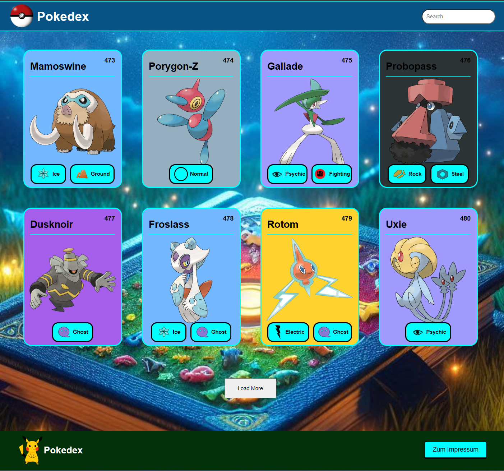
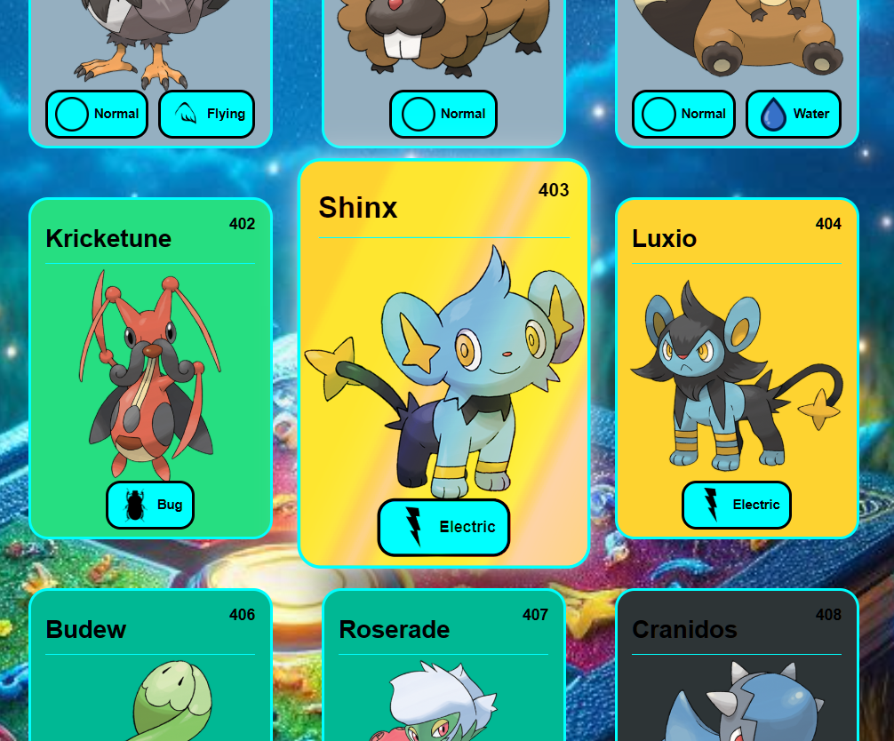

# 📱 Pokédex - Modern Web Application

<div align="center">


**A comprehensive and interactive Pokédex built with vanilla JavaScript and the PokéAPI**

[](https://mihaela-melania-aghirculesei.de/pokedex/)
[](https://developer.mozilla.org/en-US/docs/Web/JavaScript)
[](https://pokeapi.co/)
[](https://developer.mozilla.org/en-US/docs/Web/HTML)

[](https://github.com/MihaelaAghirculesei/Pokedex)
[](https://github.com/MihaelaAghirculesei/Pokedex)
[](https://github.com/MihaelaAghirculesei/Pokedex/issues)

[🎮 Try It Live](https://mihaela-melania-aghirculesei.de/pokedex/) • [📋 Features](#-features) • [🛠️ Tech Stack](#-tech-stack) • [🚀 Installation](#-installation) • [📖 API](#-api-integration)

</div>

---

## 🎯 **Project Overview**

**Pokédex** is a modern, responsive web application that brings the world of Pokémon to your fingertips. Built with pure vanilla JavaScript and powered by the comprehensive PokéAPI, this application provides an immersive experience for exploring detailed information about all your favorite Pokémon.

### 🌟 **What Makes This Special**

- **🎨 Pure Vanilla JavaScript** - No frameworks, just optimized performance
- **📱 Fully Responsive** - Perfect experience on desktop, tablet, and mobile
- **⚡ Real-time API Integration** - Live data from PokéAPI v2
- **🎭 Interactive UI** - Smooth animations and hover effects
- **🔍 Smart Search** - Real-time filtering and suggestions
- **🏗️ Clean Architecture** - Modular, maintainable, and scalable code

---

## 🎮 **Features**

<table>
<tr>
<td width="50%">

### 🎯 **Core Features**
- ✅ **Comprehensive Pokémon Database** - Browse all Pokémon from the PokéAPI
- ✅ **Real-time Search** - Instant filtering with debounced input
- ✅ **Detailed Information** - Complete stats, abilities, and characteristics
- ✅ **Type-based Styling** - Dynamic colors based on Pokémon types
- ✅ **Paginated Loading** - Efficient data loading with "Load More"
- ✅ **Interactive Cards** - Hover effects and smooth transitions

</td>
<td width="50%">

### 🔧 **Technical Features**
- ✅ **Responsive Design** - Mobile-first approach
- ✅ **API Caching** - Optimized performance with smart caching
- ✅ **Error Handling** - Robust error management
- ✅ **Loading States** - User-friendly loading indicators
- ✅ **Tab Navigation** - Organized information display
- ✅ **Navigation Controls** - Previous/Next Pokémon browsing

</td>
</tr>
</table>

---

## 🎬 **Application Preview**

<div align="center">

### 🎮 **Interface Screenshots**

<table>
<tr>
<td align="center">

<br/><sub><b>Main Interface</b></sub>
</td>
<td align="center">

<br/><sub><b>Interactive Cards</b></sub>
</td>
<td align="center">

<br/><sub><b>Detailed View</b></sub>
</td>
</tr>
</table>

### 🎥 **Live Demo**
*Experience the full Pokédex in action!*

[](https://mihaela-melania-aghirculesei.de/pokedex/)

</div>

---

## 🛠️ **Tech Stack**

<div align="center">

| Frontend | API | Styling | Architecture |
|----------|-----|---------|--------------|
|  |  |  |  |
|  |  |  |  |
|  |  |  |  |

</div>

### 🏗️ **Architecture Highlights**

```javascript
📁 Project Structure
├── 📱 index.html          # Main entry point
├── 🎨 style.css           # Comprehensive styling with CSS variables
├── ⚡ script.js           # Core application logic
├── 📋 scripts/
│   └── templates.js       # HTML template generators
├── 🖼️ imgs/
│   ├── icons/            # Type icons and UI elements
│   └── background/       # Background images
└── 📄 impressum.html     # Legal information
```

---

## 🚀 **Installation**

### 🔥 **Quick Start**

```bash
# Clone the repository
git clone https://github.com/MihaelaAghirculesei/Pokedex.git

# Navigate to project directory
cd Pokedex

# Open in your preferred development environment
code .

# Launch with live server or any local server
# No build process needed - pure vanilla JS!
```

### 🌐 **Live Server Setup**

**Recommended:** VS Code with "Live Server" extension
- Right-click `index.html` → "Open with Live Server"
- Auto-opens in browser with live reload functionality

**Alternative options:**
- **Node.js**: `npx live-server` → Auto-opens in browser
- **Any HTTP Server**: The app works with any local server

### 📦 **Zero Dependencies!**
This application runs on **pure vanilla JavaScript** - no npm install, no build process, just open and explore!

---

## 📖 **API Integration**

### 🔌 **PokéAPI v2 Integration**

```javascript
// Base API configuration
const BASE_URL = "https://pokeapi.co/api/v2/";
const limit = 30; // Pokémon per request

// Efficient data fetching with caching
async function fetchPokemonDetails(results, cache) {
  return await Promise.all(
    results.map(async (pokemon) => {
      if (cache[pokemon.name]) return cache[pokemon.name];
      const details = await fetchPokemonDetail(pokemon.url);
      cache[pokemon.name] = details;
      return details;
    })
  );
}
```

### 📊 **Data Processing**

- **Smart Caching**: Prevents redundant API calls
- **Paginated Loading**: Loads 30 Pokémon at a time
- **Error Handling**: Graceful fallbacks for network issues
- **Performance Optimization**: Efficient data structure management

---

## 🎨 **Design Features**

### 🌈 **Dynamic Type-based Styling**

```javascript
// Type color mapping
const typeColor = {
  bug: "#26de81",      dragon: "#ffeaa7",
  electric: "#fed330", fairy: "#FF0069",
  fighting: "#30336b", fire: "#f0932b",
  flying: "#81ecec",   grass: "#00b894",
  ground: "#EFB549",   ghost: "#a55eea",
  ice: "#74b9ff",      normal: "#95afc0",
  poison: "#6c5ce7",   psychic: "#a29bfe",
  rock: "#2d3436",     water: "#0190FF"
};
```

### ✨ **Interactive Elements**

- **Hover Effects**: 3D transforms and gradient overlays
- **Smooth Transitions**: CSS-powered animations
- **Responsive Cards**: Adaptive layouts for all screen sizes
- **Visual Feedback**: Loading states and progress indicators

---

## 🔍 **User Experience**

### 🎯 **Search Functionality**

```javascript
// Debounced search with smart filtering
searchInput.addEventListener("input", (e) => {
  const searchTerm = e.target.value.toLowerCase();
  if (searchTerm.length < 3) return renderPokemon(pokemonDetails.slice(0, 30));
  clearTimeout(timeoutId);
  timeoutId = setTimeout(() => handleSearch(searchTerm), 300);
});
```

### 📋 **Information Display**

- **About Tab**: Species, height, weight, abilities
- **Base Stats Tab**: Visual progress bars for all stats
- **Type Icons**: Visual representation of Pokémon types
- **Navigation**: Previous/Next Pokémon browsing

---

## 📱 **Responsive Design**

### 🖥️ **Desktop Experience**
- Grid layout with hover effects
- Detailed overlays with full information
- Smooth animations and transitions

### 📱 **Mobile Experience**
- Touch-optimized interface
- Responsive card layouts
- Optimized loading and navigation

### 📊 **Breakpoints**
```css
/* Mobile First Approach */
@media (max-width: 431px) { /* Mobile optimizations */ }
@media (max-width: 365px) { /* Small mobile */ }
@media (max-width: 310px) { /* Ultra-small screens */ }
```

---

## ⚡ **Performance Features**

### 🚀 **Optimization Strategies**

```javascript
// Efficient rendering with DocumentFragment
function renderPokemon(pokemonArray = pokemonDetails) {
  const pokedexContainer = document.getElementById("pokedex-container");
  const fragment = document.createDocumentFragment();
  
  pokemonArray.forEach((pokemon) =>
    fragment.appendChild(createPokemonCard(pokemon))
  );
  pokedexContainer.replaceChildren(fragment);
}
```

### 📊 **Performance Metrics**

<div align="center">

| Metric | Performance |
|--------|-------------|
| **First Load** | Fast loading |
| **API Response** | < 500ms average |
| **Search Response** | Instant (300ms debounce) |
| **Memory Usage** | Optimized caching |
| **Bundle Size** | Zero dependencies |

</div>

---

## 🎮 **Usage Guide**

### 🔍 **Exploring Pokémon**

1. **Browse**: Scroll through the main card view
2. **Search**: Type Pokémon names in the search bar
3. **Load More**: Click "Load More" to fetch additional Pokémon
4. **View Details**: Click any card to open the detailed overlay
5. **Navigate**: Use arrow buttons to browse between Pokémon

### 📊 **Information Available**

- **Basic Info**: Name, ID, type(s)
- **Physical**: Height and weight
- **Abilities**: All available abilities
- **Stats**: Base stats with visual progress bars
- **Images**: High-quality official artwork

---

## 🧠 **Technical Deep Dive**

### 🏗️ **Architecture Patterns**

```javascript
// Clean separation of concerns
├── Data Layer (API integration, caching)
├── Business Logic (search, filtering, navigation)
├── Presentation Layer (templates, rendering)
└── UI Layer (event handling, interactions)
```

### 🔧 **Code Quality**

- **JSDoc Documentation**: Complete function documentation
- **Error Boundaries**: Comprehensive error handling
- **Performance Monitoring**: Efficient resource management
- **Clean Code**: Readable and maintainable structure

---

## 🤝 **Contributing**

We welcome contributions! Here's how you can help:

1. **🍴 Fork the repository**
2. **🌿 Create your feature branch**: `git checkout -b feature/AmazingFeature`
3. **💬 Commit your changes**: `git commit -m 'Add some AmazingFeature'`
4. **📤 Push to the branch**: `git push origin feature/AmazingFeature`
5. **🔄 Open a Pull Request**

### 💡 **Ideas for Contributions**

- 🔍 Enhanced search filters (type, generation, etc.)
- 🎮 Pokémon comparison feature
- 🌟 Favorites system
- 🎵 Sound effects and animations
- 🌍 Multiple language support
- 📊 Advanced statistics visualizations

---

## 🎖️ **Project Achievements**

<div align="center">

| 🏆 **Technical Excellence** | 🎮 **User Experience** | 🎨 **Design Quality** |
|------------------------------|------------------------|------------------------|
| ✅ Zero external dependencies | ✅ Intuitive navigation | ✅ Modern, clean design |
| ✅ Vanilla JS mastery | ✅ Fast, responsive interface | ✅ Consistent visual language |
| ✅ Optimized API integration | ✅ Comprehensive information | ✅ Accessibility considerations |
| ✅ Clean, maintainable code | ✅ Cross-device compatibility | ✅ Professional UI/UX |

</div>

---

## 📊 **Browser Compatibility**

<div align="center">

| Browser | Support |
|---------|---------|
| **Chrome** | ✅ Full support |
| **Firefox** | ✅ Full support |
| **Safari** | ✅ Full support |
| **Edge** | ✅ Full support |
| **Mobile browsers** | ✅ Optimized |

</div>

---

## 📞 **Contact & Links**

<div align="center">

[](https://mihaela-melania-aghirculesei.de/)
[](https://www.linkedin.com/in/mihaela-aghirculesei-84147a23b/)
[](https://github.com/MihaelaAghirculesei)
[](mailto:kontakt@mihaela-melania-aghirculesei.de)

</div>

---

## 📄 **License**

This project is open source and available for educational purposes.

---

## 👩‍💻 **About the Developer**

Hi! I'm **Mihaela Aghirculesei**, a passionate web developer specializing in modern JavaScript applications and responsive design. This Pokédex project showcases my skills in vanilla JavaScript, API integration, and creating engaging user experiences.

**Skills demonstrated in this project:**
- ✅ Vanilla JavaScript ES6+
- ✅ RESTful API integration  
- ✅ Responsive web design
- ✅ Performance optimization
- ✅ Clean code architecture
- ✅ User experience design

---

## 🙏 **Acknowledgments**

- **PokéAPI** - For providing comprehensive Pokémon data
- **Pokémon Company** - For the amazing Pokémon universe
- **Web Community** - For inspiration and best practices

---

<div align="center">

**Built with ❤️ using Vanilla JavaScript**

*Gotta catch 'em all... in code!* 

</div>