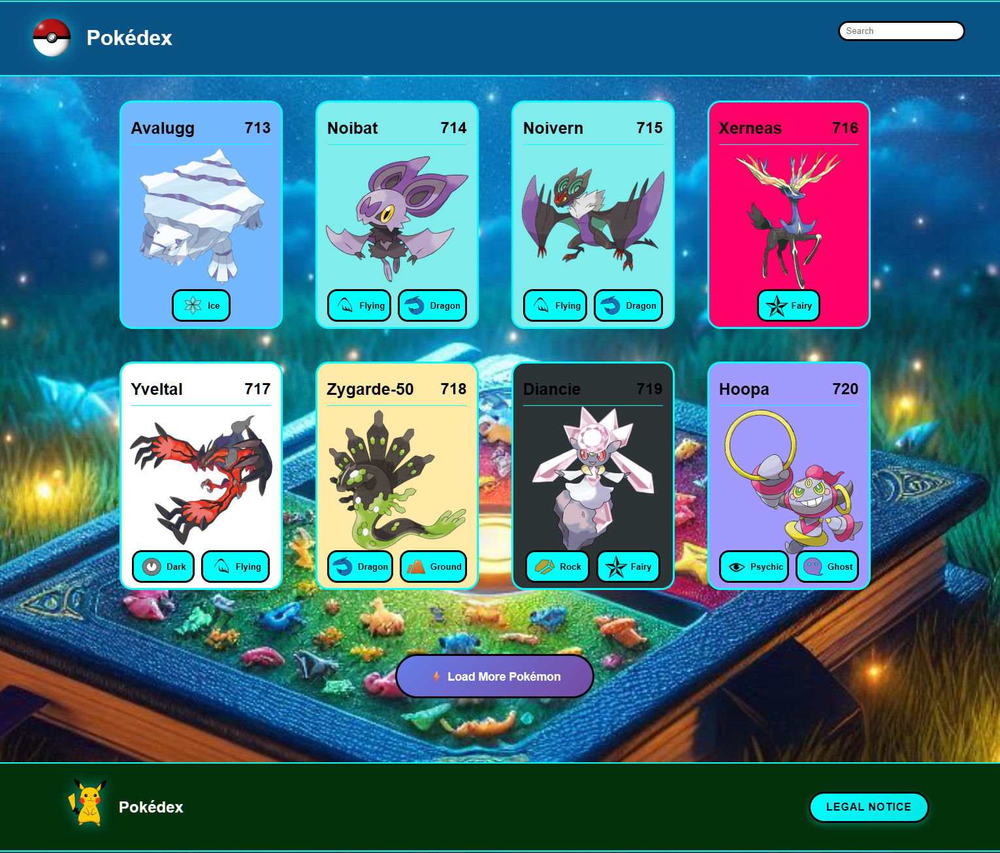
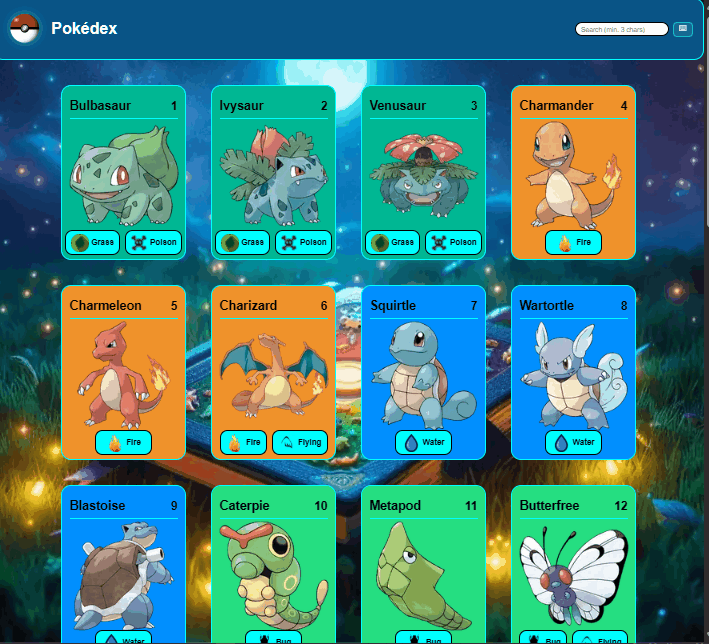
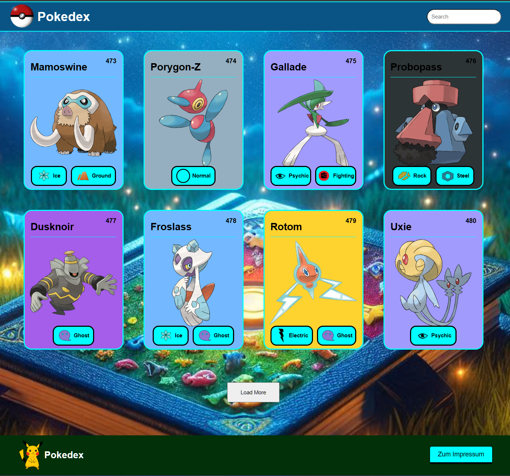
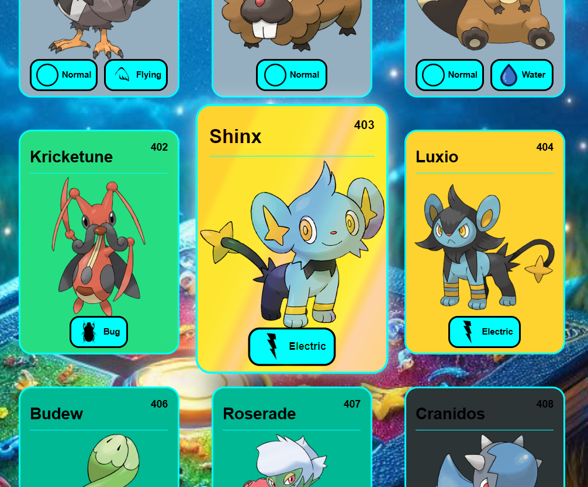
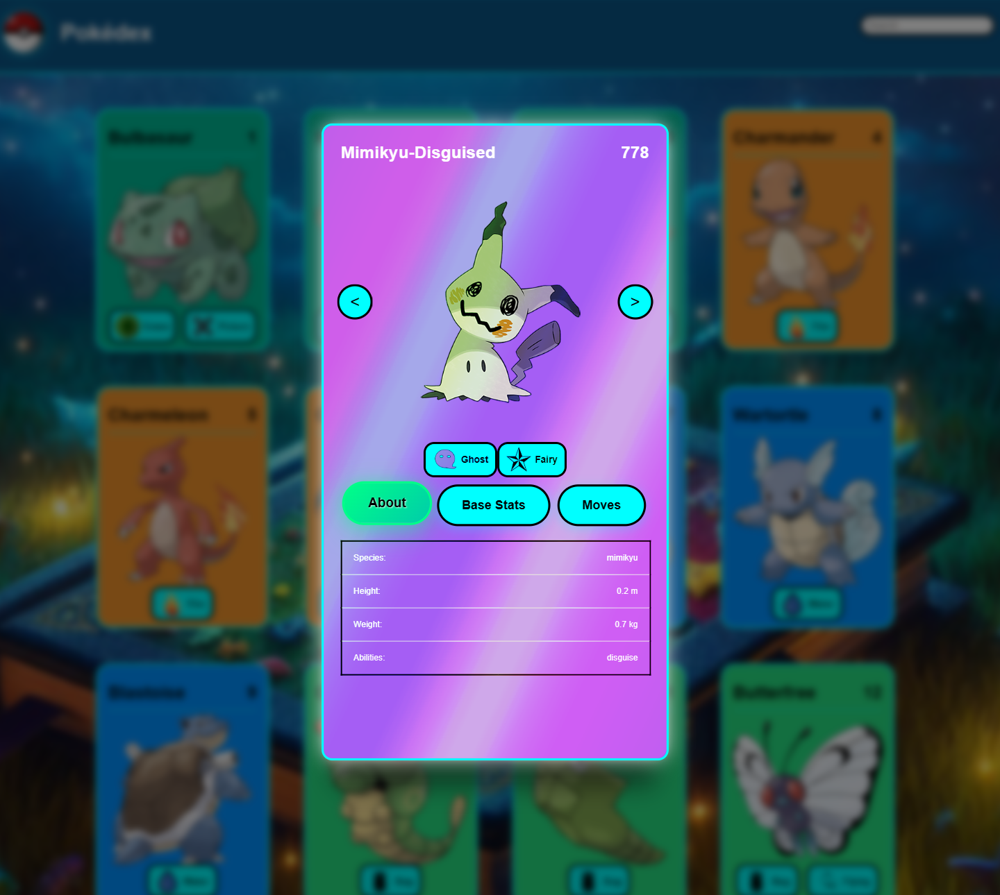

# Pokédex PWA

<div align="center">



[](https://pokedex-aghirculesei.pages.dev/)
[](https://pokedex-aghirculesei.pages.dev/)
[](https://www.typescriptlang.org/)
[](https://github.com/MihaelaAghirculesei/Pokedex/actions)
[](https://codecov.io/gh/MihaelaAghirculesei/Pokedex)
[](https://github.com/MihaelaAghirculesei/Pokedex/actions)
[](https://github.com/MihaelaAghirculesei/Pokedex/actions)
[](https://github.com/MihaelaAghirculesei/Pokedex/actions)
[](https://github.com/MihaelaAghirculesei/Pokedex/actions)

</div>

An offline-first Pokédex — originally built in pure Vanilla JavaScript to master browser APIs from scratch, then migrated to TypeScript and Vite to bring it to production quality.

---

## Demo



---

## From Vanilla JS to TypeScript — and why it matters

This project went through a deliberate two-phase journey.

### Phase 1 — Vanilla JavaScript

The first version had zero dependencies, zero build step, and zero framework overhead. Every feature was written against raw browser APIs. This was intentional: understanding the platform before abstracting it.

> The original code is preserved as-is on the [`phase-1-vanilla`](https://github.com/MihaelaAghirculesei/Pokedex/tree/phase-1-vanilla) branch — no retroactive cleanup.

```
Original stack
├── Pure Vanilla JavaScript (ES6+)     — zero framework overhead
├── Hand-crafted Service Worker        — three-tier cache (static, API, sprites)
├── Custom build-production.js script  — manual minification pipeline
└── Zero external dependencies         — maximum control, maximum learning
```

### Phase 2 — TypeScript + Vite

Once the features were solid and the architecture was proven, the codebase was migrated to TypeScript. The goal was not to rewrite — it was to enforce correctness at scale. Every original feature survived untouched. What changed was the tooling layer around it.

```
Migrated stack
├── TypeScript 6    — strict mode, noUncheckedIndexedAccess, exactOptionalPropertyTypes
├── Vite 7          — HMR in development, optimized bundles in production
├── Vitest 4        — 215 unit tests covering templates, utilities, and i18n
├── Playwright      — E2E tests with mocked PokeAPI (Chromium in CI; Firefox + WebKit locally via ALL_BROWSERS=true)
├── Workbox PWA     — declarative offline caching via vite-plugin-pwa
├── ESLint          — TypeScript strict rules + Vitest plugin
├── Husky + lint-staged — pre-commit ESLint fix, pre-push typecheck + tests
└── GitHub Actions  — CI: typecheck → lint → test → build → E2E on every push
```

**What the migration proves:** knowing when to use vanilla and when to add tooling is a more valuable skill than defaulting to a framework from the start.

---

## Why it's worth reading the code

Three things that rarely appear together in portfolio projects:

### Typed API boundary with strict null handling

Every shape returned by PokéAPI is modelled in `src/types.ts`. The `types` field on `Pokemon` is typed as `[PokemonType, ...PokemonType[]]` — a tuple that guarantees at least one element, so `pokemon.types[0]` never needs a null check. `noUncheckedIndexedAccess` and `exactOptionalPropertyTypes` in `tsconfig.json` make TypeScript reject any unsafe assumption about optional data.

### Keyboard accessibility following WAI-ARIA guidelines

Focus is **trapped inside the modal** (Tab/Shift+Tab cycle through interactive elements only), **ESC closes** the overlay, **← → navigate** between Pokémon, **↑ ↓ switch tabs** (About / Base Stats / Moves), and focus **restores to the previously active element** on close. Keyboard and mouse modes are mutually exclusive — moving the mouse removes the keyboard focus ring immediately.

### Holographic shimmer that actually follows the cursor

Mouse position is tracked via `mousemove` (throttled with `requestAnimationFrame`), normalized to `--x`/`--y` CSS custom properties, and consumed by a pseudo-element gradient using `mix-blend-mode: color-dodge`. The gradient position shifts with the cursor, replicating the light-shift of physical Pokémon trading cards.

---

## Browser support

| Browser             | Version | Notes                                            |
| ------------------- | ------- | ------------------------------------------------ |
| Chrome / Edge       | 90+     | Full support; PWA install via address bar        |
| Firefox             | 90+     | Full support                                     |
| Safari / iOS Safari | 15.4+   | Full support; PWA via Share → Add to Home Screen |
| Samsung Internet    | 14+     | Full support                                     |

Tested in CI with Playwright on **Chromium** (every push) and **Firefox + WebKit** locally (`ALL_BROWSERS=true npm run test:e2e`). Requires ES2020 — no IE support.

---

## Performance & Quality

Lighthouse CI runs automatically on every push (`npm run lighthouse:ci` to reproduce locally). Scores measured on a production build with simulated 4× mobile CPU throttling; external API calls are excluded so results reflect only the app itself.

| Category       |         Score | CI threshold |
| -------------- | ------------: | :----------: |
| Performance    |  **91 / 100** |     ≥ 80     |
| Accessibility  | **100 / 100** |     ≥ 90     |
| Best Practices | **100 / 100** |     ≥ 90     |
| SEO            | **100 / 100** |     ≥ 90     |

**Core Web Vitals** — cold-cache first visit, 4× mobile CPU throttle, external API blocked:

> On repeat visits the Service Worker serves all assets from cache — LCP drops under 1 s and layout shift is eliminated.

| Metric                         | Value |     |
| ------------------------------ | ----: | --- |
| First Contentful Paint (FCP)   | 1.1 s | 🟢  |
| Largest Contentful Paint (LCP) | 2.9 s | 🟡  |
| Total Blocking Time (TBT)      |  0 ms | 🟢  |
| Cumulative Layout Shift (CLS)  | 0.169 | 🟡  |

🟢 Good · 🟡 Needs improvement — LCP is dominated by the full-bleed background image on first load; a preload hint has been added to improve subsequent runs.

---

## Quick start

```bash
git clone https://github.com/MihaelaAghirculesei/Pokedex.git
cd Pokedex
npm install
npm run dev
```

Open `http://localhost:5173` in your browser.

### Available scripts

| Command                              | Description                                                      |
| ------------------------------------ | ---------------------------------------------------------------- |
| `npm run dev`                        | Start dev server with HMR                                        |
| `npm run build`                      | Production build to `dist/`                                      |
| `npm run preview`                    | Preview the production build locally                             |
| `npm test`                           | Run unit tests with Vitest                                       |
| `npm run test:coverage`              | Tests + coverage report (HTML + lcov)                            |
| `npm run test:e2e`                   | E2E tests with Playwright (Chromium + mobile Chrome)             |
| `ALL_BROWSERS=true npm run test:e2e` | Full cross-browser E2E: Chromium, Firefox, WebKit — local only   |
| `npm run typecheck`                  | TypeScript type check (no emit)                                  |
| `npm run lint`                       | ESLint on `src/`                                                 |
| `npm run lint:fix`                   | ESLint on `src/` with auto-fix                                   |
| `npm run analyze`                    | Production build + open bundle visualizer                        |
| `npm run ci:local`                   | Full CI pipeline locally (typecheck → lint → test → build → E2E) |

---

## Deployment

The live version runs on **Cloudflare Pages** (zero-config static hosting — no server required).

### Deploy to Cloudflare Pages

1. Push the repo to GitHub (already done if you cloned this).
2. In the [Cloudflare Pages dashboard](https://pages.cloudflare.com/), create a new project and connect your GitHub repo.
3. Set the build configuration:

   | Setting                | Value           |
   | ---------------------- | --------------- |
   | Build command          | `npm run build` |
   | Build output directory | `dist`          |
   | Node.js version        | `22`            |

4. Click **Save and Deploy** — Cloudflare runs the build and assigns a `*.pages.dev` URL automatically.
5. Every subsequent push to `main` triggers a new deploy.

### Deploy to any static host

The output of `npm run build` is a fully self-contained `dist/` folder (HTML + JS + CSS + assets + pre-cached Service Worker). Upload it to any CDN or static host (GitHub Pages, Netlify, Vercel, etc.) with no additional configuration.

```bash
npm run build   # produces dist/
# upload dist/ to your host
```

> The Service Worker uses absolute URLs, so set the correct `base` in `vite.config.ts` if you deploy to a subdirectory (e.g. `base: '/my-app/'`).

---

## Features

<table>
<tr>
<td width="50%">

**Core**

- Type-based dynamic color theming on cards
- Search by name (substring) **or by Pokémon ID number** — with 300ms debounce
- Progressive "Load More" pagination
- Tabbed detail overlay (About, Base Stats, Moves)
- Visual stat bars via `<progress>` element with formatted names (HP, Sp. Attack…)
- Slide animation on prev/next Pokémon navigation
- **DE / EN language toggle** on the Legal Notice page — preference saved via `localStorage`
- `prefers-reduced-motion` — all animations disabled for users who request it

</td>
<td width="50%">

**PWA / Offline**

- Workbox Service Worker — auto-generated, cache-first strategy
- API responses cached up to 7 days (300 entries max)
- Pokémon sprites cached up to 30 days (600 entries max)
- Custom 404 page consistent with the app design
- Installable on desktop and mobile
- `manifest.json` with separate `maskable` and `any` icons
- Update toast — notifies the user when a new version is available after a silent SW update

</td>
</tr>
</table>

---

## Keyboard navigation

| Key                 | Context      | Action                                         |
| ------------------- | ------------ | ---------------------------------------------- |
| `→` / `←`           | Card grid    | Navigate between Pokémon cards                 |
| `Enter` / `Space`   | Focused card | Open detail overlay                            |
| `ESC`               | Overlay open | Close overlay, restore focus                   |
| `→` / `←`           | Overlay open | Next / previous Pokémon                        |
| `↑` / `↓`           | Overlay open | Switch tab (About → Base Stats → Moves)        |
| `Tab` / `Shift+Tab` | Overlay open | Cycle through overlay controls (focus trapped) |

- Reaching the last card with `→` moves focus to **Load More**
- After loading more Pokémon, focus jumps automatically to the first new card

---

## Screenshots

<div align="center">
<table>
<tr>
<td align="center">

<br/><sub>Main grid</sub>
</td>
<td align="center">

<br/><sub>Holographic hover</sub>
</td>
<td align="center">

<br/><sub>Detail overlay</sub>
</td>
</tr>
</table>
</div>

---

## Tech

| Layer         | Phase 1 — Vanilla JS                    | Phase 2 — TypeScript                                                           |
| ------------- | --------------------------------------- | ------------------------------------------------------------------------------ |
| Language      | Vanilla JavaScript (ES6+)               | TypeScript 6 — strict mode                                                     |
| Build         | None (direct file serving)              | Vite 7 — HMR + optimized bundles                                               |
| Offline       | Hand-crafted Service Worker             | Workbox via vite-plugin-pwa                                                    |
| Testing       | None                                    | Vitest 4 — unit tests + Playwright E2E (Chromium in CI; cross-browser locally) |
| Linting       | None                                    | ESLint + typescript-eslint strict                                              |
| Git hooks     | None                                    | Husky + lint-staged (pre-commit fix, pre-push gate)                            |
| Styling       | CSS3 — Grid, Flexbox, Custom Properties | Unchanged                                                                      |
| Data          | PokéAPI v2 via Fetch + AbortController  | Unchanged                                                                      |
| Security      | None                                    | DOMPurify + HTTP security headers (CSP, X-Frame-Options…)                      |
| Accessibility | WAI-ARIA, focus trap, keyboard nav      | Unchanged                                                                      |

---

## Install as PWA

**Desktop (Chrome / Edge):** click the install icon in the address bar → runs in a standalone window.

**Android:** Menu → _Add to Home screen_ or _Install app_.

**iOS / Safari:** Share → _Add to Home Screen_.

---

## Contact

[](https://aghirculesei.pages.dev/)
[](https://www.linkedin.com/in/mihaela-aghirculesei-84147a23b/)
[](https://github.com/MihaelaAghirculesei)
[](mailto:aghirculesei@gmail.com)

---

## License

MIT — Pokémon data via [PokéAPI](https://pokeapi.co/docs/v2).
